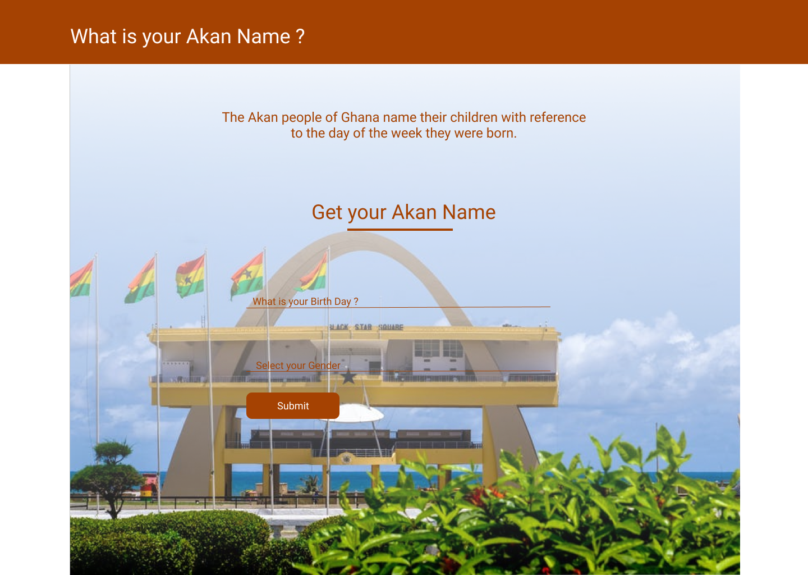

# Akan Name Generator

#### A Simple Web Application that Generates your Akan Name, 13th December, 2021.
#### By **Timothy Otieno**

## Description
- This web Application Generates a user's Akan name based on their birth date and gender.
- A user inputs their Birth date and Gender on the provided input field and their Akan name is displayed.
- If there is an error, the user is alerted to take action.

## Setup/Installation Requirements
* Clone this repository using the link `https://github.com/otienotimothy/Get-birthday.git`
* Open the index.html file on your prefered browser.

## Technologies Used
- HTML
- CSS
-JAVASCRIPT

## Support and contact details
Feel free to reach out to me on <otieno.timothy@student.moringaschool.com> for any enquiries.

### License
Copyright 2021 Timothy Otieno

Permission is hereby granted, free of charge, to any person obtaining a copy of this software and associated documentation files (the "Software"), to deal in the Software without restriction, including without limitation the rights to use, copy, modify, merge, publish, distribute, sublicense, and/or sell copies of the Software, and to permit persons to whom the Software is furnished to do so, subject to the following conditions:

The above copyright notice and this permission notice shall be included in all copies or substantial portions of the Software.

THE SOFTWARE IS PROVIDED "AS IS", WITHOUT WARRANTY OF ANY KIND, EXPRESS OR IMPLIED, INCLUDING BUT NOT LIMITED TO THE WARRANTIES OF MERCHANTABILITY, FITNESS FOR A PARTICULAR PURPOSE AND NONINFRINGEMENT. IN NO EVENT SHALL THE AUTHORS OR COPYRIGHT HOLDERS BE LIABLE FOR ANY CLAIM, DAMAGES OR OTHER LIABILITY, WHETHER IN AN ACTION OF CONTRACT, TORT OR OTHERWISE, ARISING FROM, OUT OF OR IN CONNECTION WITH THE SOFTWARE OR THE USE OR OTHER DEALINGS IN THE SOFTWARE.
Copyright (c) 2021.